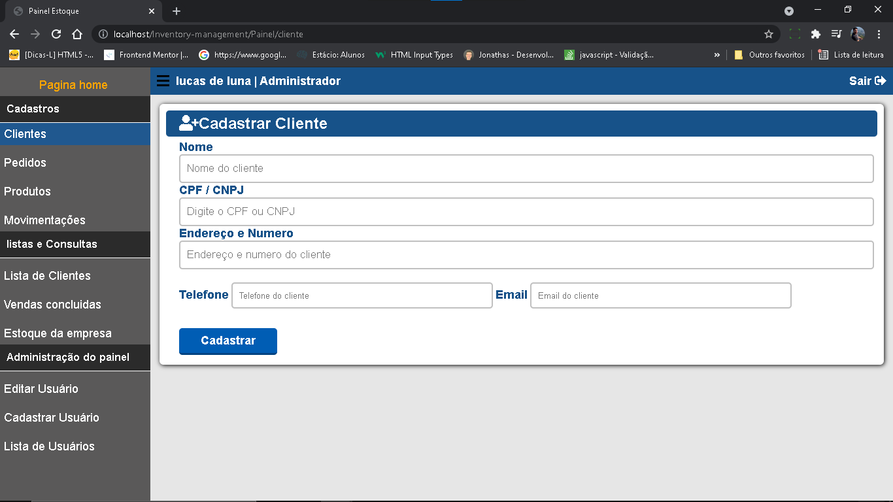
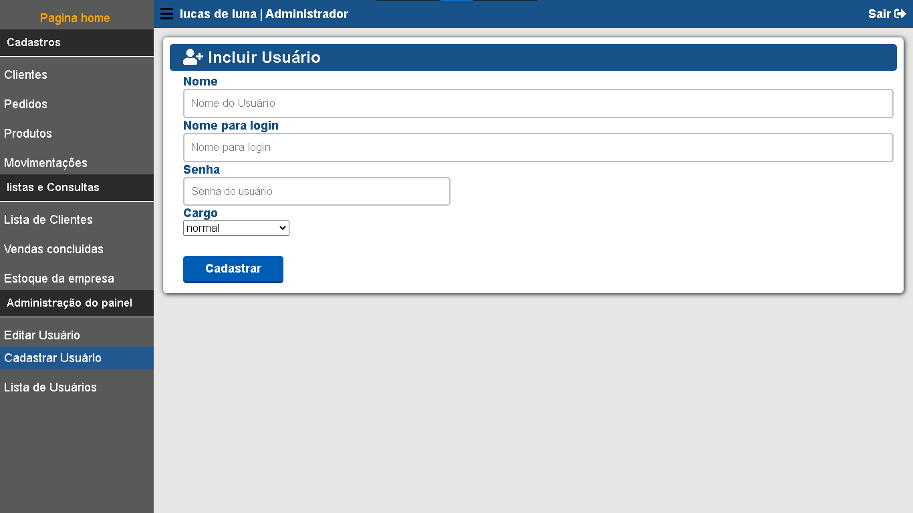
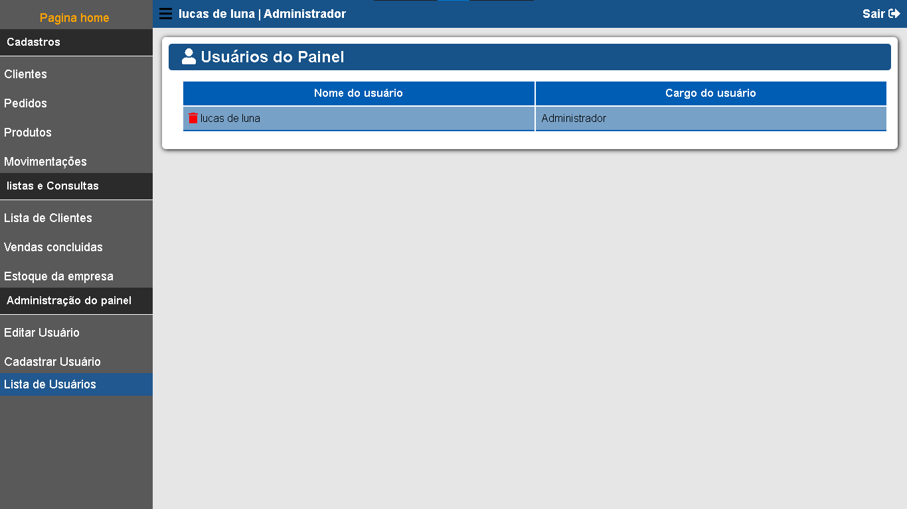

# Terms condition

<H1>Gestão de Inventario</H1>

Painel de controle para gestão de estoque, o projeto se econtra em desenvolvimento. Objetivo desse projeto é para controlar a saída e entrada de produtos, item mais vendido. Controlando o estoque da empresa.

## Imagens

<H1>Features</H1>

✅ JavaScript / Usado para fazer animações,Menu,redirecionar url, e alertas.

✅ PHP - Usado para fazer todo o back-end do painel.

✅ SQL - Usado para se comunicar com o banco de dados.

✅ CSS3 - Usado para fazer o estilo do site e sistema.

## Como você pode ajudar.

➡ Algumas sessões já estão feitas como cadastro de clientes e usuarios, lista de cliente
 

➡ você pode contribuir em outras sessôes que ainda não foram feitas, como pedidos,estoque,movimentação, onde podemos ver a saída e entrada de produtos. ou apenas melhorando algum codigo.

➡ E claro aceito dicas e críticas construtivas, fica a vontade. rs

➡ Aqui está o modelo do banco de dados. <a href="estoque.sql">Database<a>
.user e senha é lucas e lucas.

